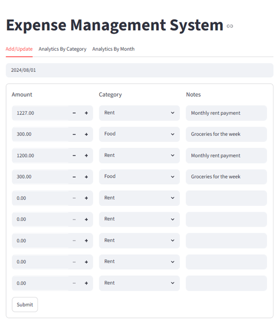
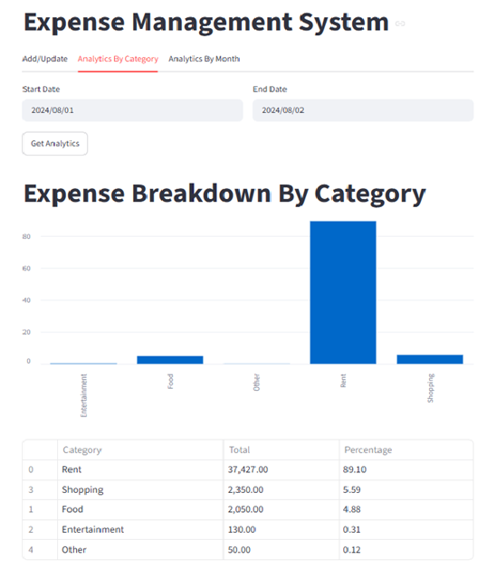
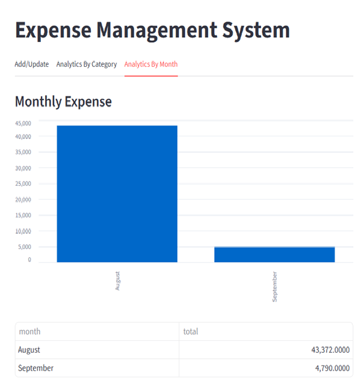

# 💰 Expense Management System

A full-stack Expense Management System built using **Python**, **FastAPI**, **Streamlit**, and **MySQL**. This application allows users to manage daily expenses, analyze spending by category, and visualize monthly expense trends through an interactive dashboard.

---

## 📌 Features

### ✅ Add & Update Expenses
- Select any date.
- Add multiple expenses for the selected day.
- Edit existing expenses.
- Save all changes with a single click.

### 📊 Expense Analytics
- View expense distribution by category.
- Analyze expenses between any date range.
- Display spending percentage for each category.
- Interactive bar charts.

### 📅 Monthly Analytics
- View total expenses month-wise.
- Monthly expense visualization using charts.
- Tabular monthly summary.

### ⚡ Backend API
- RESTful APIs built with FastAPI.
- Data validation using Pydantic.
- Logging support.
- MySQL database integration.

---

# 🛠️ Tech Stack

## Backend
- Python
- FastAPI
- Pydantic
- MySQL
- mysql-connector-python

## Frontend
- Streamlit
- Pandas
- Requests

## Database
- MySQL

---

# 📂 Project Structure

```
Project_Expense_Tracking/
│
├── Backend/
│   ├── db_helper.py
│   ├── logging_setup.py
│   ├── server.py
│   └── server.log
│
├── Frontend/
│   ├── app.py
│   ├── add_update_ui.py
│   ├── analytics_ui.py
│   └── monthly_analytics_ui.py
│
├── tests/
│
├── requirements.txt
└── README.md
```

---

# 🚀 Getting Started

## 1. Clone the repository

```bash
git clone https://github.com/yourusername/Expense-Management-System.git

cd Expense-Management-System
```

---

## 2. Create Virtual Environment

Windows

```bash
python -m venv .venv

.venv\Scripts\activate
```

Linux / Mac

```bash
python3 -m venv .venv

source .venv/bin/activate
```

---

## 3. Install Dependencies

```bash
pip install -r requirements.txt
```

---

## 4. Create MySQL Database

Create a database named:

```sql
expense_manager
```

Create the expenses table:

```sql
CREATE TABLE expenses (
    id INT AUTO_INCREMENT PRIMARY KEY,
    expense_date DATE,
    amount DECIMAL(10,2),
    category VARCHAR(100),
    notes VARCHAR(255)
);
```

---

## 5. Configure Database

Update your MySQL credentials inside

```
Backend/db_helper.py
```

```python
connection = mysql.connector.connect(
    host="localhost",
    user="root",
    password="your_password",
    database="expense_manager"
)
```

---

# ▶️ Running the Application

### Step 1: Start FastAPI Server

Navigate to the Backend folder.

```bash
cd Backend

python -m uvicorn server:app --reload
```

Server runs at

```
http://127.0.0.1:8000
```

---

### Step 2: Start Streamlit

Open another terminal.

```bash
cd Frontend

streamlit run app.py
```

Application runs at

```
http://localhost:8501
```

---

# 📡 API Endpoints

## Get Expenses

```http
GET /expenses/{expense_date}
```

Example

```
GET /expenses/2024-08-01
```

---

## Add / Update Expenses

```http
POST /expenses/{expense_date}
```

Example Request

```json
[
    {
        "amount": 500,
        "category": "Food",
        "notes": "Lunch"
    },
    {
        "amount": 1200,
        "category": "Shopping",
        "notes": "Shoes"
    }
]
```

---

## Category Analytics

```http
POST /analytics
```

Example

```json
{
    "start_date":"2024-08-01",
    "end_date":"2024-08-31"
}
```

---

## Monthly Analytics

```http
GET /analytics/monthly
```

---

# 📈 Application Workflow

```
Streamlit UI
      │
      ▼
FastAPI REST API
      │
      ▼
Database Helper
      │
      ▼
MySQL Database
```

---

# 📸 Screenshots

You can add screenshots here after uploading images to GitHub.

Example:

```
screenshots/

├── home.png
├── analytics.png
└── monthly.png
```

Then use

```markdown
## Home



## Analytics



## Monthly Analytics


```

---

# 📚 Learning Objectives

This project demonstrates:

- CRUD Operations
- REST API Development
- FastAPI Basics
- Streamlit Dashboard Development
- MySQL Database Integration
- Data Visualization
- Logging
- Modular Project Structure
- Python Backend Development

---

# 🔮 Future Improvements

- User Authentication
- Expense Categories Management
- Delete Individual Expense
- CSV & Excel Export
- Expense Search
- Dashboard Cards
- Dark Theme
- Docker Support
- Unit Testing
- Deployment on Render/AWS

---

# 🤝 Contributing

Contributions are welcome!

Feel free to fork this repository and submit a Pull Request.

---

# 📄 License

This project is licensed under the MIT License.

---

# 👨‍💻 Author

**Haseeb Ali Jaffri**

If you found this project useful, don't forget to ⭐ the repository.
